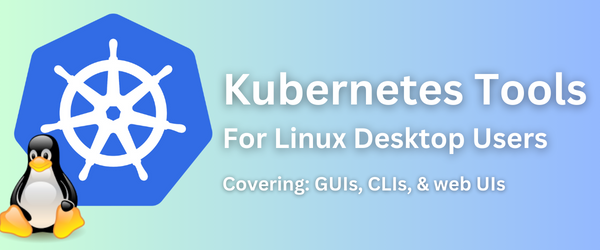

# Awesome Kubernetes Resources For Linux Desktop Users

If you're a Linux desktop user and are looking for GUIs (and CLIs) to manage a cluster, here are some resources that might be useful.

**Out of scope:** 

- Kubernetes cluster managers themselves (as in microk8s)
- Kubernetes deployment environments that run on Linux (ie, solutions aimed to encouraging Linux users to set up test clusters on their localhost)

(Note: written by an Ubuntu user so biased towards this distro. Also note: information correct only at the time of initial upload and may be outdated).

## IDEs & GUIs With Linux Support 

GUIs and IDEs that aim to make it easier for Linux users to administer Kubernetes clusters from their Linux workstation:

- **[Aptakube](https://aptakube.com/)**  GUI for managing clusters. Available as a Debian for Ubuntu and Debian-based distros and as an appimage. 15 day free trial and after that it's a subscription service.
- **[Kubernetic](https://www.kubernetic.com/?utm_source=the+new+stack&utm_medium=referral&utm_content=inline-mention&utm_campaign=tns+platform)**: Marketing line: "The Kubernetes Desktop Client - cluster management, simplified". The Linux client is an appimage. 
- [**Lens - The Kubernetes IDE**](https://k8slens.dev/): Probably the most well-rounded solution for Linux users who want a GUI to help manage their cluster (opinion) is Lens Desktop. For Linux there's a .deb, a .rpm, a .snap and an AppImage - so whatever distro you're running it should be fairly easy to get up and running with it. Lens is an IDE and also presents a terminal environment.
- [**Podman Desktop**](https://podman-desktop.io/): For Linux there's a flatpak and a tar.gz. You can parse Kubernetes YAML files directly using Podman Engine and generate Kubernetes YAML from existing pods.
- **[JetPilot](https://github.com/unxsist/jet-pilot)**: Jet Pilot is a cross-platform Kubernetes desktop client that will run on Linux. 

## Web UIs That Will Run On Linux Machines

Web UIs that (almost always) aren't Linux-specific but which can also run off a Linux localhost

- **[Kubernetes Dashboard](https://github.com/kubernetes/dashboard)** Not Linux-specific, of course, but  ... as a Linux user, you can run this on your localhost to manage your cluster (whether it's running locally or on a remote)
- **[Portainer:](https://www.portainer.io)**  Another great option for Linux users who wish to manage their cluster through running a web UI off their local machine is Portainer. Portainer works by installing an agent on the remote cluster. 
- [**Headlamp**](https://headlamp.dev/): "Out of the box, Headlamp is a fully functional Kubernetes UI. By leveraging its powerful plugin system, builders can shape Headlamp to fit their bespoke use-cases, products, and environments."
- **[minikube GUI](https://minikube.sigs.k8s.io/docs/tutorials/setup_minikube_gui/)**: In prototyping stage 

## CLIs With Linux Support (And "Hybrids")

The line between GUIs and CLIs can get a bit blurry with GUIs that leverage a CLI as a key feature (see: Kubernetic) and CLIs that try to bring some graphic elements into their operation. CLIs for Kubernetes management are tools that try to take the core CLIs for Kubernetes management and enrich them with some additional features (or commonly by making them a bit more visually interactive)

- **[KUI](https://kui.tools/)** "We love CLIs, and think they are critical for interacting in a flexible way with the cloud. We need the power to go off the rails. But ASCII is tedious. Kui takes your normal kubectl command line requests and responds with graphics. Instead of ASCII tables, you are presented with sortable ones. Instead of copying and pasting long auto-generated resource names to drill down, in Kui you just click."

- [k9s](https://github.com/derailed/k9s): "Kubernetes CLI to manage your clusters in style"

  

## Other Kubernetes Tools With Linux Support

Tools intended for other functionalities such as visualising apps running on Kubernetes clusters:

- [Octant](https://octant.dev/community/) - "A tool for developers to understand how applications run on a Kubernetes cluster." The project was backed by VMWare although its Github page is in archive-only mode so development of the open source fork may no longer be active.  The project's [last release](https://github.com/vmware-archive/octant/releases) was in February 2022 but includes a .deb, a .rpm, and a .tar.gz (for both 64-bit and ARM architectures)
